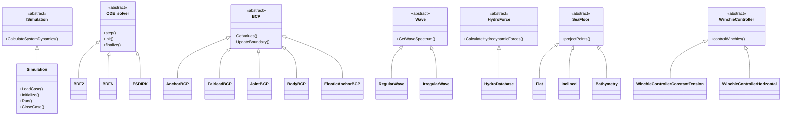
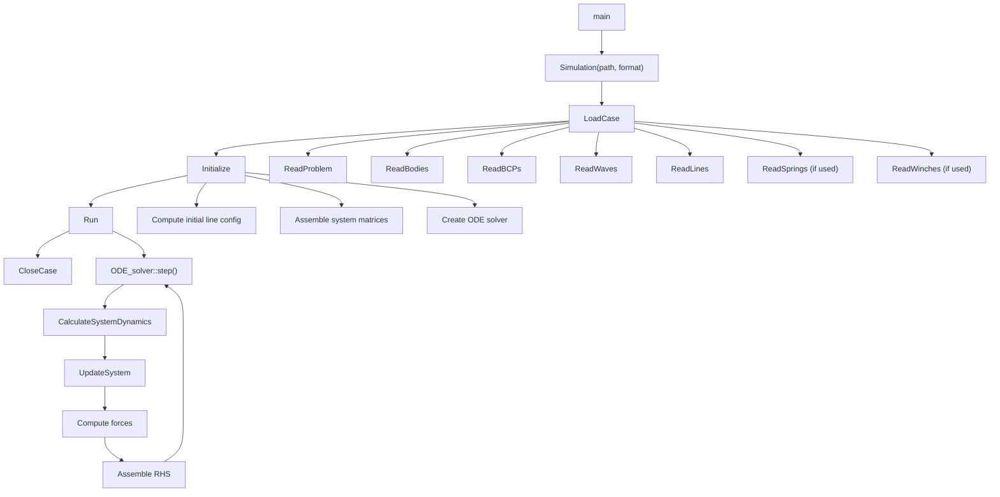

# Code Structure

This page describes the OASIS source code architecture for developers who want to understand, modify, or extend the codebase.

## Directory Layout

```
src/
├── main.cpp                 # Entry point
├── CommonTools.cpp/hpp      # Shared utilities
├── MathTools.cpp/hpp        # Math helpers
├── os_tools.cpp/hpp         # OS abstraction
├── version.hpp              # Version info (generated from git)
├── Simulations/             # Main orchestrator
├── Bodies/                  # Rigid body dynamics (6-DOF)
├── Lines/                   # Mooring lines (SEM-based)
├── BCPs/                    # Boundary Condition Points + winches
├── Waves/                   # Wave kinematics
├── Hydro/                   # Hydrodynamic forces (EHYDB/H5)
├── ODE_solvers/             # Time integration
├── Spring/                  # Spring elements
├── SeaFloor/                # Seabed models
├── Sinking/                 # Progressive flooding
├── WindTurbine/             # OpenFAST coupling
├── OWC/                     # Oscillating Water Columns
├── SEM_math/                # Spectral Element quadrature
└── Exceptions/              # Custom exception class
```

## Class Hierarchy



## Simulation Lifecycle



### Entry Point

`main.cpp` parses the project path from `argv[1]`, auto-detects the input format (checks for `input/dataProblem.yaml` first, falls back to `input/dataProblem.dat`), then runs the simulation lifecycle:

```cpp
Simulation* mySim = new Simulation(project_path, data_format);
mySim->LoadCase();
mySim->Initialize();
mySim->Run();
mySim->CloseCase();
```

### Composition

`Simulation` owns all physical components via pointer arrays:

| Member | Type | Description |
|---|---|---|
| `pBodies` | `Body**` | All bodies |
| `pLines` | `Line**` | All mooring lines |
| `pBcps` | `BCP**` | All boundary condition points |
| `pSprings` | `Spring**` | All springs |
| `pWave` | `Wave*` | Wave object |
| `pWinches` | `Winchie**` | All winches |
| `pTimeSolver` | `ODE_solver*` | Active time integrator |
| `pSeaFloor` | `SeaFloor**` | All seabed surfaces |
| `pSinking` | `Sinking**` | Flooding compartments |
| `pWindTurbines` | `WindTurbine**` | Wind turbines |
| `pOWCs` | `OWC**` | OWC chambers |

### Input Format Dispatch

`Simulation` uses function pointers to dispatch between ASCII and YAML readers:

```cpp
// Set at construction time based on data_format
pReadProblem = &Simulation::ReadProblemASCII;   // or ReadProblemYAML
pReadBodies  = &Simulation::ReadBodiesASCII;    // or ReadBodiesYAML
// ... etc.
```

### ODE Integration

The ODE solver calls `ISimulation::CalculateSystemDynamics(t, y)` to compute the right-hand side at each time step. This method:

1. Extracts component states from the state vector `y`
2. Calls `UpdateSystem(t)` to update all component positions and velocities
3. Computes all forces (hydrodynamic, mooring, spring, winch, wind turbine)
4. Assembles the time derivative vector `yprime`

The state vector `y` contains DOFs from all subsystems: body positions/velocities, line node positions/velocities, winch angles/angular velocities, and OWC states.

## Dependencies

| Library | Required | Purpose |
|---|---|---|
| **Armadillo** | Yes | Linear algebra (matrices, vectors) |
| **HDF5** | Yes | Hydrodynamic database I/O |
| **BLAS/LAPACK** | Yes | Numerical linear algebra backend |
| **yaml-cpp** | Yes | YAML input file parsing |
| **SuperLU** | Optional | Sparse direct solver |
| **OpenMP** | Optional | Parallelisation |
| **OpenFAST** | Optional | Wind turbine coupling |
| **stl_reader** | Optional | STL mesh import for seabed/body meshes |

## Build Options

| CMake Option | Default | Description |
|---|---|---|
| `OASIS_USE_OPENFAST` | OFF | Enable OpenFAST wind turbine coupling |
| `OASIS_USE_SUPERLU` | ON | Enable SuperLU sparse solver |
| `OASIS_USE_STL_READER` | ON | Enable STL mesh reader |

## Compiler Settings

| Platform | Optimisation | Standard |
|---|---|---|
| GCC/Clang | `-O3 -march=native -ffast-math` | C++17 |
| MSVC | `/O2 /fp:fast` | C++17 |

LTO (Link-Time Optimisation) is enabled in Release builds.
