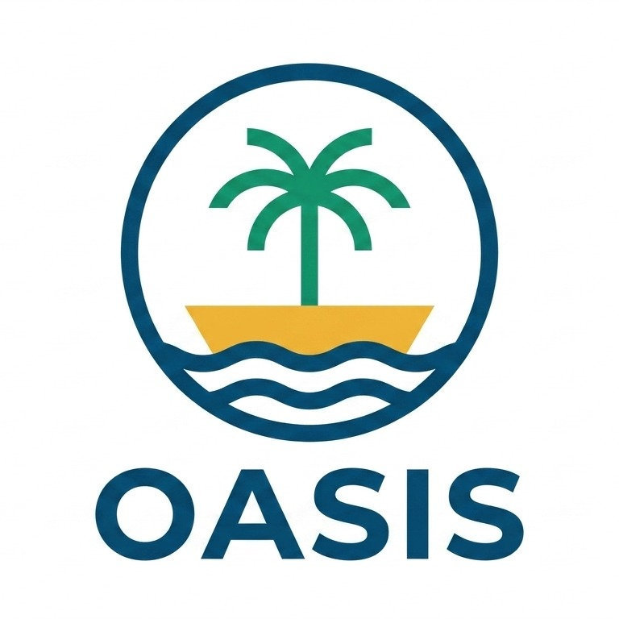

# OASIS — Offshore Advanced SImulation Software

<p align="center">
  
</p>

OASIS is a time-domain numerical simulation tool for offshore floating structures, developed in C++ by [IHCantabria](https://ihcantabria.com). It couples potential-flow hydrodynamics with structural and mooring dynamics to predict the motion response of floating platforms under waves, wind and current.

---

## Features

| Feature | Description |
|---|---|
| **Potential-flow hydrodynamics** | First-order radiation/diffraction forces from a pre-computed hydrodynamic database |
| **Second-order wave loads** | Fast QTF-based evaluation of slow-drift and sum-frequency excitation forces |
| **Non-linear hydrostatics** | Exact Froude–Krylov and restoring forces on the instantaneous wetted surface |
| **Dynamic mooring lines** | High-order spectral element formulation with seabed contact and irregular bathymetries |
| **Quasi-static mooring lines** | Catenary-based solver for fast preliminary assessments |
| **Wind turbine coupling** | Interface to OpenFAST for aero-servo-elastic simulation of floating offshore wind turbines |
| **Morison drag model** | Current drag and viscous damping via Morison coefficients |
| **Connectors & fenders** | Versatile spring/damper model for multi-body contact and boundary coupling points |
| **Oscillating Water Column** | Simplified wave energy converter model with pneumatic chamber dynamics |
| **OpenMP parallelisation** | Multi-threaded execution on shared-memory machines |

---

## Quick Start

### 1. Install & Build

=== "Windows (vcpkg)"

    ```bat
    vcpkg install armadillo hdf5[cpp] openblas superlu metis:x64-windows
    compile.bat
    ```

=== "Linux"

    ```bash
    cmake -B build -S . -DCMAKE_BUILD_TYPE=Release
    cmake --build build -j$(nproc)
    ```

See [Installation — Windows](installation/windows.md) or [Installation — Linux](installation/linux.md) for full instructions.

### 2. Run an Example

```bash
cd examples/body/free_decay/input
../../../../bin/oasis .
```

See [Running Simulations](user-manual/running-simulations.md) and [Examples](user-manual/examples.md) for details.

---

## Documentation Sections

<div class="grid cards" markdown>

-   :material-download: **[Installation](installation/windows.md)**

    Step-by-step build instructions for Windows (vcpkg) and Linux/HPC clusters.

-   :material-book-open-variant: **[User Manual](user-manual/index.md)**

    Input file formats, running simulations, output files, and feature-specific guides for waves, mooring lines, springs, winches, OWCs, wind turbines, and ODE solvers.

-   :material-code-braces: **[Developer Manual](developer-manual/code-structure.md)**

    Source code architecture, build system details, and contribution guidelines.

-   :material-math-integral: **[Theory Manual](theory-manual.md)**

    Mathematical formulations — hydrostatics, hydrodynamics, mooring line FEM, time integration.

-   :material-api: **[API Reference](api-reference.md)**

    Auto-generated C++ class and function documentation (Doxygen).

</div>

---

## Project Structure

```
oasis/
├── CMakeLists.txt                  Main build system
├── CMakeUserConfig.cmake.template  Template for local build paths
├── compile.bat / compile.sh        Quick build scripts (Windows / Linux)
├── src/                            C++ source code
├── examples/                       Ready-to-run example cases
├── resources/                      Python plotting utilities
├── cmake/                          CMake helper modules
├── docs/                           MkDocs documentation source
│   └── theory-manual/              Theory manual (LaTeX source + assets)
├── oasis_gui/                      PyQt5 graphical interface
│   ├── main.py                     Entry point — run with `python main.py`
│   ├── requirements.txt            Python dependencies
│   ├── data/                       Case data model + YAML I/O + output reader
│   ├── editors/                    Per-module form editors
│   └── views/                      Schematic, run and results views
└── resources/                      Python plotting utilities
```

---

## Related Projects

| Project | Description |
|---|---|
| [SeaMotions](https://github.com/IHCantabria/SeaMotions) | BEM solver by IHCantabria that generates the hydrodynamic databases (`.hydb.h5`) consumed by OASIS — first-order radiation/diffraction, QTFs, multi-body and OWC support. |
| [OpenFAST](https://github.com/OpenFAST/openfast) | Aero-servo-elastic wind turbine simulator; OASIS couples to it for floating offshore wind simulations. |
| [FASTurbine wrapper](https://github.com/IHCantabria/FASTurbine_wrapper) | Thin DLL interface around OpenFAST used by OASIS on Windows. |

---

## License

Developed by [IHCantabria](https://ihcantabria.com). See license terms for details.
