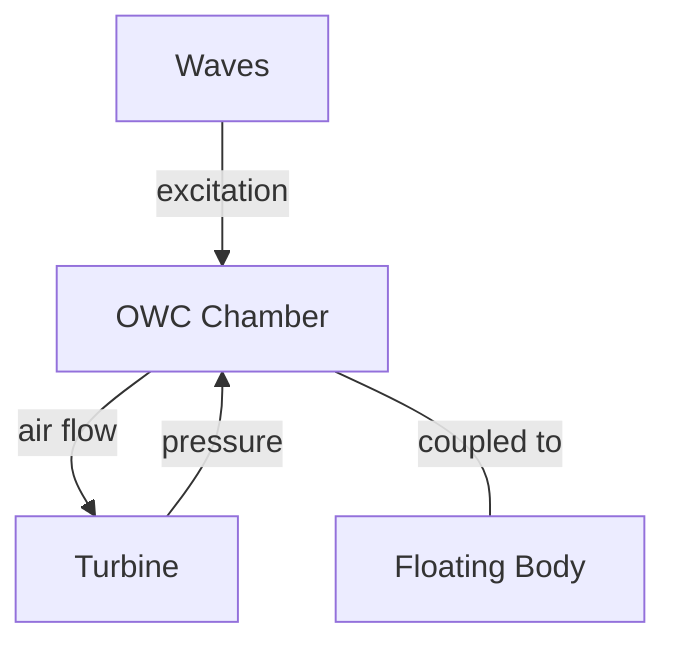

# Oscillating Water Columns

Oscillating Water Columns (OWCs) model pneumatic energy conversion chambers where wave-induced water oscillation compresses and expands air through a turbine.

## Concept

An OWC chamber is a partially submerged structure open at the bottom. Waves cause the internal water surface to oscillate, compressing the air above it and driving flow through a turbine (Wells or impulse type).

## Configuration

OWC chambers are defined in `dataOWCs.dat`. Each chamber is associated with a body in the hydrodynamic database (multi-body HDB with one floater + N OWC bodies).

Turbine properties are defined in `dataOWCTurbines.dat`.

## Output Files

| File | Columns |
|---|---|
| `OWC_<ID>.txt` | Time, Displacement, Velocity, Pressure |

Header: `Time  Displacement  Velocity  Pressure`

## Related Examples

!!! warning "Work in Progress"
    OWC examples are under active development.

| Example | Feature |
|---|---|
| `owcs/free_decay` | Chamber free oscillation |
| `owcs/excitation` | Wave excitation on OWC |
| `owcs/hole_coupling` | Pneumatic coupling through orifice |
| `owcs/turbine_coupling` | OWC with turbine model |
