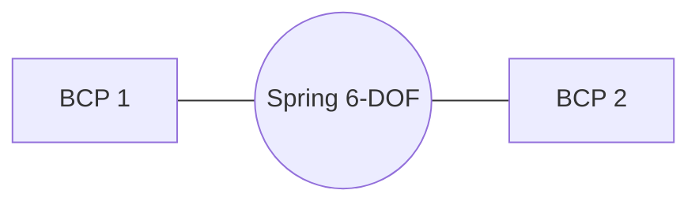

# Springs & Connectors

Springs in OASIS model mechanical connections between two Boundary Condition Points (BCPs). They support linear and nonlinear constitutive models, damping, and stick-slip friction.

## Overview

Each spring connects two BCPs and computes forces in 6 degrees of freedom (3 translational + 3 rotational) using local coordinate frames defined by orientation vectors.



## Spring Properties

| Parameter | Type | Description |
|---|---|---|
| `stressModelFlag` | int | 1 = linear (matrix), 2 = nonlinear (stress-strain curves) |
| `dampingFlag` | int | 0 = no damping, 1 = viscous damping |
| `frictionFlag` | int | 0 = none, 1 = velocity-based, 2 = stick-slip |
| `frameFlag` | int | 0 = average frame, 1 = BCP1 frame, 2 = BCP2 frame |
| `BCP_1`, `BCP_2` | int | Global BCP indices (1-based in input, converted to 0-based) |
| `BCP_1_type`, `BCP_2_type` | int | 0 = fixed point, 1 = point on line, 2 = point on plane |

## Orientation Vectors

Six unit vectors define the local coordinate frames at each BCP — three at BCP1 (normal, tangent-y, tangent-z) and three at BCP2. These vectors must form orthonormal bases.

Forces are computed in the local frame defined by `frameFlag`:

- **0** — average of both BCP frames
- **1** — BCP1 frame
- **2** — BCP2 frame

## Stiffness Models

### Linear (`stressModelFlag = 1`)

A 6×6 stiffness matrix $\mathbf{K}$ relates displacements to forces:

$$\mathbf{F} = \mathbf{K} \cdot \boldsymbol{\delta}$$

### Nonlinear (`stressModelFlag = 2`)

Each DOF has an independent stress-strain curve defined as a piecewise-linear lookup table:

- **Displacements**: vector of $N$ displacement values
- **Forces**: $6 \times N$ matrix — one row per output DOF at each displacement point

This allows cross-coupling: displacement in DOF 1 can produce forces in DOFs 1–6.

## Damping

When `dampingFlag = 1`, a 6×1 damping vector $\mathbf{D}$ provides viscous damping per DOF:

$$\mathbf{F}_d = \mathbf{D} \cdot \dot{\boldsymbol{\delta}}$$

## Friction

### Velocity-based (`frictionFlag = 1`)

A smooth transition between static and dynamic friction using cubic polynomial interpolation.

### Stick-slip (`frictionFlag = 2`)

| Parameter | Symbol | Description |
|---|---|---|
| `mu_d` | $\mu_d$ | Dynamic friction coefficient |
| `mu_s` | $\mu_s$ | Static friction coefficient |
| `vt` | $v_t$ | Transition velocity [m/s] |
| `Dt` | $D_t$ | Maximum displacement for stick phase [m] |

A 6×6 friction matrix $\mathbf{M}$ scales the friction forces. The spring transitions between stick (elastic deformation below $D_t$) and slip (kinetic friction at $\mu_d$).

## Input Format

=== "ASCII"

    In `dataSprings.dat`:

    ```
    1               // Number of springs
    //////////////////
    ////////////////// New spring [1]
    //////////////////
    2               // stressModelFlag (nonlinear)
    1               // dampingFlag
    1               // frictionFlag
    1               // frameFlag (BCP1 frame)
    1               // BCP_1 (1-based)
    2               // BCP_2 (1-based)
    1               // BCP_1_type (on line)
    0               // BCP_2_type (fixed)
    1.0 0.0 0.0     // normal vector BCP1
    0.0 1.0 0.0     // tangent-y BCP1
    0.0 0.0 1.0     // tangent-z BCP1
    1.0 0.0 0.0     // normal vector BCP2
    0.0 1.0 0.0     // tangent-y BCP2
    0.0 0.0 1.0     // tangent-z BCP2
    // 6x6 stiffness matrix (36 values)
    ...
    // friction coefficients
    0.02            // mu_d
    0.20            // mu_s
    0.001           // vt
    0.01            // Dt
    // 6x6 friction matrix
    ...
    // 6x1 damping vector
    200000.0
    200000.0
    0.0
    0.0
    0.0
    0.0
    // stress-strain curves (6 DOFs)
    5               // n points for DOF 1
    -100 -1.0 0.0 1.0 100        // displacements
    -1e12 -4.5e6 0.0 15e6 1e12   // forces DOF 1
    0.0 0.0 0.0 0.0 0.0          // forces DOF 2
    ...                           // forces DOF 3-6
    // repeat for DOF 2-6
    ```

=== "YAML"

    In `dataProblem.yaml`:

    ```yaml
    springs:
      - stress_model_flag: 2
        damping_flag: 1
        friction_flag: 1
        frame_flag: 1
        BCP_1: 1
        BCP_2: 2
        BCP_1_type: 1
        BCP_2_type: 0
        vectors:
          - [1.0, 0.0, 0.0]
          - [0.0, 1.0, 0.0]
          - [0.0, 0.0, 1.0]
          - [1.0, 0.0, 0.0]
          - [0.0, 1.0, 0.0]
          - [0.0, 0.0, 1.0]
        stiffness_matrix:
          - [0.0, 0.0, 0.0, 0.0, 0.0, 0.0]
          # ... 6 rows
        mu_d: 0.02
        mu_s: 0.20
        vt: 0.001
        Dt: 0.01
        mass_matrix:
          - [0.0, 1.0, 0.0, 0.0, 0.0, 0.0]
          # ... 6 rows
        damping_vector: [200000.0, 200000.0, 0.0, 0.0, 0.0, 0.0]
        stress_strain:
          - displacements: [-100, -1.0, 0.0, 1.0, 100]
            forces:
              - [-1e12, -4.5e6, 0.0, 15e6, 1e12]
              - [0.0, 0.0, 0.0, 0.0, 0.0]
              # ... 6 rows
          # repeat for DOF 2-6
    ```

## Related Examples

| Example | Feature |
|---|---|
| `springs/pile_connector` | Pile-to-anchor spring with friction |
| `springs/neoprene_connector` | Body-to-body neoprene+wire connection |
