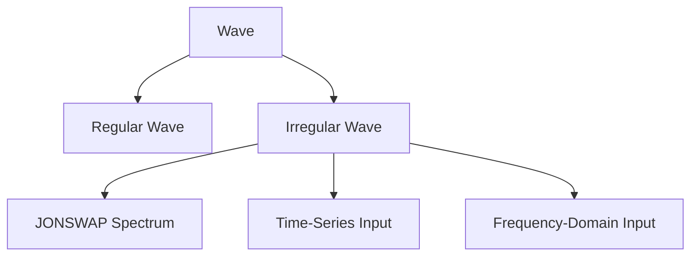

# Waves

Waves in OASIS drive hydrodynamic excitation forces on floating bodies. The wave system supports regular, irregular (spectral), and user-defined wave inputs.

## Wave Types



### Regular Waves (`REG`)

Single monochromatic sinusoidal wave.

| Parameter | Symbol | Units | Description |
|---|---|---|---|
| Height | $H$ | m | Wave height (crest to trough) |
| Period | $T$ | s | Wave period |
| Heading | $D$ | deg | Propagation direction |
| Ramp time | $t_r$ | s | Linear ramp-up duration |

The surface elevation is:

$$\eta(x,t) = \frac{H}{2} \cos(kx - \omega t) \cdot R(t)$$

where $R(t)$ is a linear ramp from 0 to 1 over $t_r$ seconds.

### Irregular Waves (`IRR`)

Spectral sea states composed of multiple wave components. Three input modes are available, selected by `specType_flag`:

#### 1. JONSWAP Spectrum (`specType_flag = 1`)

Generates a JONSWAP spectrum analytically following the IEC 61400-3 standard:

$$S(\omega) = \alpha_{\text{PM}} \cdot \gamma^{\exp\left[-\frac{(\omega - \omega_p)^2}{2\sigma^2 \omega_p^2}\right]}$$

| Parameter | Description | Typical value |
|---|---|---|
| $H_s$ | Significant wave height | — |
| $T_p$ | Peak period | — |
| $\gamma$ | Peak enhancement factor | 3.3 |
| $s$ | Directional spreading exponent | < 1 = no spreading |
| $d\theta$ | Heading discretisation | 10° |

Supports **multi-directional spreading** via the cosine-power model:

$$G(\theta) = \cos^s(\theta - \theta_0)$$

Supports **piecewise decomposition**: the simulation time is split into windows for faster wave elevation computation.

!!! tip "Random Phases"
    Set `readPhases_flag = 1` to read phase angles from a file for reproducible results. Otherwise, random phases are generated each run.

#### 2. Time-Series Input (`specType_flag = 2`)

Reads a pre-computed wave elevation time series and converts to frequency domain via FFT.

**File format** (`wave.dat`):

```
3001 0
0.0   0.523
0.1   0.612
0.2   0.487
...
```

- Line 1: number of points, followed by `0`
- Data lines: `time [s]` `elevation [m]`

Supports piecewise decomposition.

#### 3. Frequency-Domain Input (`specType_flag = 3`)

Reads wave components directly in the frequency domain.

**File format** (`wavefreq.dat`):

```
150
0.0500  0.0  0.0312  1.2345
0.0600  0.0  0.0456  2.3456
0.0500  15.0 0.0112  0.5678
...
```

- Line 1: total number of components
- Data lines: `frequency [Hz]` `heading [deg]` `amplitude [m]` `phase [rad]`

Each frequency-heading combination is listed separately. This format supports multi-directional, non-parametric wave fields from external models (e.g., numerical wave propagation tools).

!!! note
    Piecewise decomposition is not available for frequency-domain input.

## Input Configuration

=== "ASCII"

    In `dataWaves.dat`:

    ```
    //////////////////
    ////////////////// Basic wave data
    //////////////////
    IRR             // Wave type
    2.0             // Hs [m]
    10.0            // Tp [s]
    0.0             // Heading [deg]
    5.0             // Ramp time [s]
    //////////////////
    ////////////////// Irregular wave data
    //////////////////
    1               // specType_flag (JONSWAP)
    0               // piecewise_flag
    //// JONSWAP
    3.3             // gamma
    0.0             // s (spreading, <1 = none)
    10.0            // dtheta [deg]
    0.001           // factor
    0               // readPhases_flag
    0.05            // relTol
    0.1             // dt [s]
    none            // phase filename
    //// CUSTOM
    none            // data filename
    ```

=== "YAML"

    In `dataProblem.yaml`:

    ```yaml
    waves:
      type: IRR
      Hs: 2.0
      Tp: 10.0
      heading: 0.0
      ramp_time: 5.0
      spectrum:
        type: 1
        piecewise: 0
        gamma: 3.3
        s: 0.0
        dtheta: 10.0
        factor: 0.001
        read_phases: 0
        rel_tol: 0.05
        dt: 0.1
        phase_file: none
        data_file: none
    ```

## Output Files

| File | Content | Header |
|---|---|---|
| `WaveSpectrum.txt` | Frequency [Hz], Spectral density [m²/Hz], Amplitude [m] | `# Wave Spectrum` |
| `WaveTimeSeries.txt` | Time [s], Elevation [m] | `# Wave Time Series` |
| `WavePhases.txt` | Phase matrix (Armadillo ASCII format) | — |

## Constraints

- Wave period must be non-zero
- Wave height must satisfy the Miche breaking criterion
- Heading discretisation $d\theta$ must divide 360° evenly (e.g., 10°, 15°, 30°, 45°)
- For piecewise: spectrum frequency step $df = 1/(N \cdot dt)$

## Related Examples

| Example | Feature |
|---|---|
| `waves/regular` | Regular wave |
| `waves/jonswap` | JONSWAP spectrum |
| `waves/jonswap_piecewise` | Piecewise-decomposed JONSWAP |
| `waves/multidirectional` | Multi-directional spreading |
| `waves/timeseries` | Time-series input |
| `waves/frequency_domain` | Frequency-domain input |
