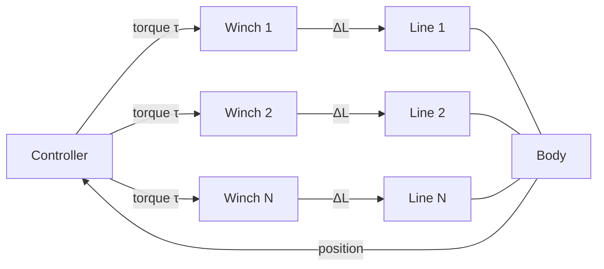

# Winches

Winches in OASIS are mechanical drums that control mooring line lengths and tensions. They work in conjunction with mooring lines and a centralised controller that can position a floating body in the horizontal plane.

## Concept

Each winch is attached to one end of a mooring line. By rotating its drum, the winch pays out or reels in cable, changing the effective line length. The controller coordinates multiple winches to achieve a target body position (surge, sway, yaw).



## Winch Properties

Each winch is defined by 5 parameters:

| Parameter | Symbol | Units | Description |
|---|---|---|---|
| Line index | — | — | Which mooring line (1-based) |
| Line end | — | — | 1 = first node, 2 = last node |
| Moment of inertia | $I$ | kg·m² | Drum inertia |
| Drum radius | $r$ | m | Drum radius |
| Drag coefficient | $d$ | N·s/rad | Rotational damping |

## Dynamics

The winch equation of motion balances tension torque, motor torque, and damping:

$$I \cdot \alpha = r \cdot F - \tau - d \cdot \omega$$

where:

- $F$ = line tension at the connected end
- $\tau$ = motor torque (from controller)
- $\omega$ = angular velocity
- $\alpha$ = angular acceleration

The line length change is proportional to drum rotation:

$$\Delta L = \frac{\Delta L_0 \cdot (L + r\theta)}{L}$$

Each winch adds 2 DOFs ($\theta$, $\omega$) to the system state vector.

## Controller

The `WinchieController` coordinates all winches to position the body using a state-space control law.

### Controller Parameters

| Parameter | Description |
|---|---|
| `indBody` | Index of the body being controlled (1-based) |
| `Ac, Bc, Cc, Dc` | Controller state-space coefficients |
| `Kc` (3 values) | Lead controller gains (surge, sway, yaw) |
| `Ki` (3 values) | Integral time gains |
| `Af, Bf, Cf` | Filter state-space coefficients |
| `Ar, Br, Cr, Dr` | Reference model state-space coefficients |
| `ur` (3 values) | Reference position setpoint (x, y, heading) |
| `Kw` | Winch gain |
| `t_start` | Time to start controlling [s] |

### Inversor Block

The inversor maps desired body forces (surge, sway, yaw) to individual winch tensions:

| Type | Description |
|---|---|
| 1 | Straight-line mapping |
| 2 | Coefficient-based mapping |

Constraints enforce maximum and minimum operational tensions.

## Input Configuration

### dataWinches.dat

```
8               // Number of winches
//////////////////
////////////////// New winchie [1]
//////////////////
1               // Line index (1-based)
2               // Line end (last node)
50.0            // Moment of inertia [kg·m²]
0.25            // Drum radius [m]
0.5             // Drag coefficient [N·s/rad]
//////////////////
////////////////// New winchie [2]
//////////////////
2               // Line index
2               // Line end
50.0            // Moment of inertia
0.25            // Radius
0.5             // Drag
```

### dataWinchesController.dat

```
//////////////////
////////////////// Controller parameters
//////////////////
1                               // Body index (1-based)
0.3679 1 -0.6315 1             // [Ac Bc Cc Dc]
3900 5200 120000                // Kc gains
0.003 0.003 0.002               // Ki gains
0.9842 0.125 0.1263             // [Af Bf Cf]
0.9950 0.0625 0.0798 0.0       // [Ar Br Cr Dr]
4 3 0.08727                     // Reference position (x, y, yaw)
10000.0                         // Winch gain (Kw)
20.0                            // Start time [s]
//////////////////
////////////////// Inversor block inputs
//////////////////
1                               // Inversor type
6.0                             // Max tension [tons]
2.0                             // Min tension [tons]
```

## Activation

Winches are automatically activated when any BCP in `dataBCPs.dat` has a non-zero `winchId`:

```
//////////////////
////////////////// New BCP [1] [Anchor] [1]
//////////////////
200.0 0.0 -50.0     // Position
1                    // Winch Id (>0 activates winch system)
```

This triggers loading of both `dataWinches.dat` and `dataWinchesController.dat`.

## Output Files

| File | Content |
|---|---|
| `WinchesTensions.txt` | Time + tension per winch |
| `WinchedLinesLengths.txt` | Time + line length per winch |
| `ControlForce.txt` | Time + 3 control force components |
| `ReferencePosition.txt` | Time + 3 reference position values |

## Related Examples

| Example | Feature |
|---|---|
| `winches/horizontal_control` | Surge/sway/yaw positioning with state-space controller |
