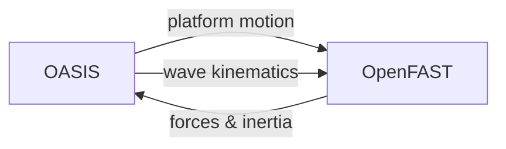

# Wind Turbines

OASIS couples with [OpenFAST](https://github.com/OpenFAST/openfast) to simulate offshore wind turbines on floating or fixed-foundation platforms. The coupling handles structural loads, aerodynamics, and control through the FASTurbine wrapper.

## Coupling Architecture

OASIS provides platform kinematics (position, velocity, acceleration) to OpenFAST, which returns:

- Tower-base forces and moments
- Turbine inertia matrices (body, tower, turbine)
- Rotor loads

## Requirements

OpenFAST coupling requires:

1. **OpenFAST 3.0.0** compiled as a shared library
2. **Intel oneAPI** Fortran compiler (for OpenFAST build)
3. **FASTurbine wrapper** (included in OASIS, requires separate build)
4. CMake flag: `-DUSE_OPENFAST=ON`

See [Installation — Windows](../installation/windows.md#openfast-setup-optional) for build instructions.

## Configuration

Wind turbine definitions are provided in `dataWindTurbines.dat`. Each turbine is attached to a body and references an OpenFAST input file.

### Time Steps

Two dedicated time steps control the coupling:

| Parameter | Description |
|---|---|
| `fastTimeStep` | OpenFAST structural time step (in `dataProblem.dat`) |
| `fastControllerTimeStep` | OpenFAST controller time step (in `dataProblem.dat`) |

These can differ from the OASIS hydrodynamic time step to match OpenFAST's requirements.

## Output Files

| File | Format |
|---|---|
| `FASTurbW_<ID>_bodyInerMat.dat` | 6×6 body inertia matrix (Armadillo ASCII) |
| `FASTurbW_<ID>_towrInerMat.dat` | Tower inertia matrix |
| `FASTurbW_<ID>_turbInerMat.dat` | Turbine inertia matrix |
| `WindTurbineForce_Body_<ID>.txt` | Time + wind turbine forces on body |

## Related Examples

| Example | Feature |
|---|---|
| `turbines/fixed_turbine` | Turbine on fixed-foundation body |
| `turbines/moored_turbine` | Turbine on moored floating platform |
